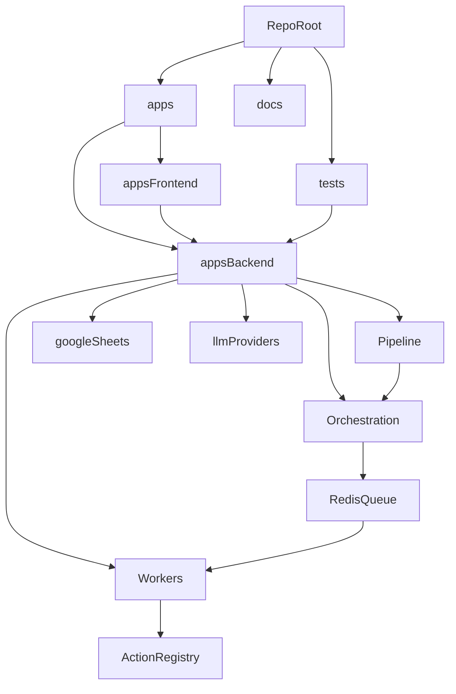

# Architecture Overview

This repo uses a lightweight monorepo-style layout with separate app directories and shared top-level docs/tests.

## Structure

```text
all-doing-bot/
├── apps/
│   ├── backend/
│   └── frontend/
├── docs/
│   ├── architecture/
│   ├── implementation-plan.md
│   └── instructions/
└── tests/
```

## System map



## Backend

`apps/backend/` contains:

- FastAPI app entrypoint
- Staged pipeline (Parse → Plan → Execute → Store)
- Provider-based LLM layer (Ollama, local GGUF, remote, mock)
- Adapter-based extractor and Google Sheets DB layer
- Action registry with **contracts** (capability_id, error taxonomy, idempotency)
- **Orchestration**: queue abstraction (in-memory or Redis), step events, run state (durable checkpoints when Redis is set)
- **Workers**: `apps.backend.workers.run_worker` consumes step jobs from the queue, executes actions with retries, writes step results
- **Telemetry**: structured run/step events and action_exec logs for correlation and metrics

The backend import root is `apps.backend`. See [action-contracts.md](./action-contracts.md) and [durable-checkpoints.md](./durable-checkpoints.md).

## Frontend

`apps/frontend/` is a static HTML/JS app that:

- submits queries
- polls task status
- lists cohorts
- displays entries

## Tests

`tests/` stays at the repo root so backend and integration-style tests can run from one place with:

```bash
python -m pytest tests -q
```
