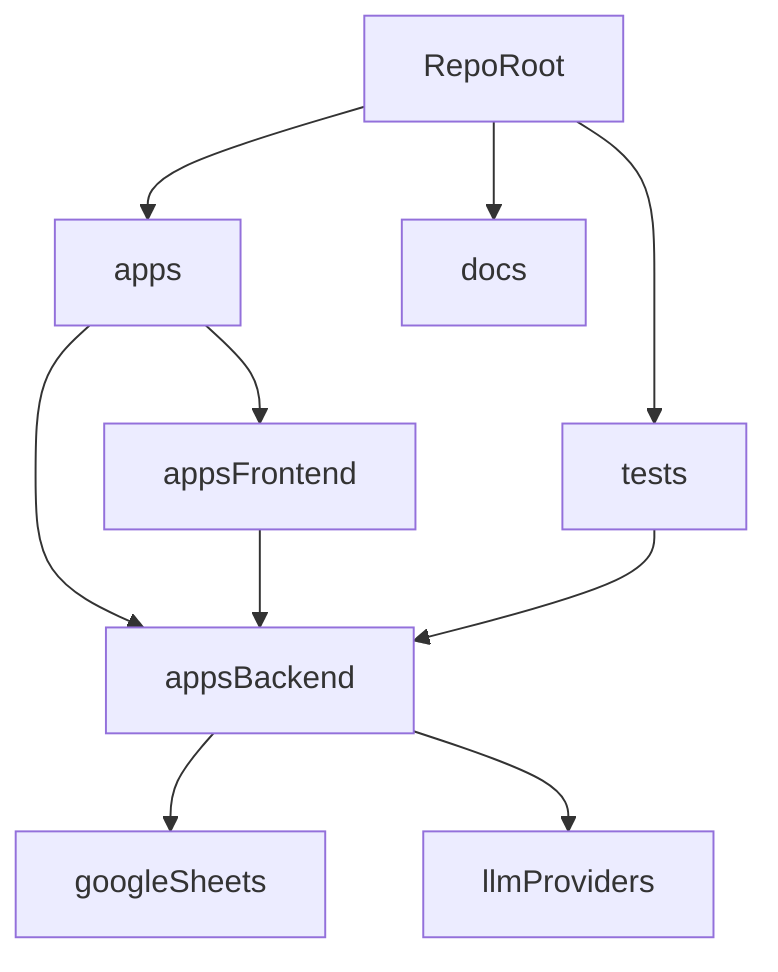

# Architecture Overview

This repo uses a lightweight monorepo-style layout with separate app directories and shared top-level docs/tests.

## Structure

```text
all-doing-bot/
├── apps/
│   ├── backend/
│   └── frontend/
├── docs/
│   ├── architecture/
│   ├── implementation-plan.md
│   └── instructions/
└── tests/
```

## System map



## Backend

`apps/backend/` contains:

- FastAPI app entrypoint
- staged pipeline
- provider-based LLM layer
- adapter-based extractor
- Google Sheets DB layer
- action registry

The backend import root is `apps.backend`.

## Frontend

`apps/frontend/` is a static HTML/JS app that:

- submits queries
- polls task status
- lists cohorts
- displays entries

## Tests

`tests/` stays at the repo root so backend and integration-style tests can run from one place with:

```bash
python -m pytest tests -q
```
