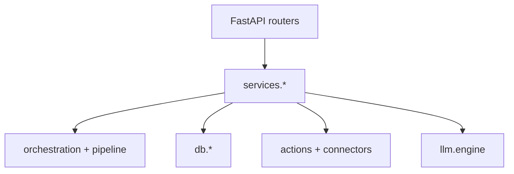

# Phase 1 — Target Architecture (`all-doing-bot`)

**Status:** Blueprint (not yet fully implemented). Migrate in vertical slices; keep tests green after each slice.

---

## Design principles (locked)

1. **Locality of behaviour** — Everything needed to understand `/chat` lives under one package; same for long pipeline.
2. **Explicit over implicit** — No side-effect imports; routers register in one visible list.
3. **One-way data flow** — API → service → adapters → IO. No service importing FastAPI.
4. **Flat where possible** — Nested packages only when ≥3 modules share a private contract.
5. **Types first** — Public request/response and domain DTOs in dedicated modules; implementation imports them.

---

## Target directory structure (backend)

```text
apps/backend/
├── main.py                    # create_app(), mount routers, lifespan only (< 120 lines target)
├── config.py                  # Settings (unchanged role)
├── api/
│   ├── deps.py                # get_settings, get_queue, optional auth
│   ├── routes_health.py
│   ├── routes_chat.py         # GET /chat — delegates to services/chat.py
│   ├── routes_pipeline.py    # /query, /status, cohort reads
│   ├── routes_workflows.py   # task/note list + create (or keep paths, move handlers)
│   └── routes_admin.py       # clear-data, future ops
├── services/
│   ├── chat_service.py       # transcript load, gate, retrieval stack, direct LLM, persist
│   ├── pipeline_service.py   # enqueue + task lifecycle (thin wrapper over existing executor)
│   └── cohort_service.py     # catalogue + list/detail
├── domain/                    # optional rename from “models” if you split API vs domain
│   ├── chat.py               # ChatWebRoute, transcript DTOs
│   ├── pipeline.py           # ParsedIntent, PlanOutput, …
│   └── entries.py            # Entry, Cohort
├── agents/                    # unchanged conceptually
├── actions/
├── connectors/
├── db/
├── extractor/
├── llm/
├── orchestration/
├── pipeline/                  # executor, router, task_store, stages — keep until merged into services
├── telemetry/
├── workers/
└── workflows/                 # merge into services/workflows or keep as thin DB helpers
```

**Rationale:** `main.py` today violates single responsibility; splitting routers makes OpenAPI grouping obvious and enables focused tests (`tests/api/test_chat.py` hitting router with overrides).

---

## Module contracts (minimum)

| Module | Exposes | Must not |
|--------|---------|----------|
| `services/chat_service` | `async def handle_chat(q, session_key) -> str` | Import FastAPI |
| `api/routes_chat` | HTTP validation, status codes | Call `run_action` directly |
| `pipeline/executor` | `run_full_pipeline` | Parse query strings for HTTP |
| `db/chat_transcript` | load/append transcript | Decide routing |

---

## Data flow (target)



---

## State management

| State | Mechanism |
|-------|-----------|
| Run / task | `task_store` (in-memory) + optional Redis run meta |
| Session chat | `chat_transcript` + `memory_store` mirror |
| Durable rows | Google Sheets cohorts |
| LLM | Stateless calls; no server-side conversation except transcript |

No global mutable singletons in **new** code except explicitly documented process-wide resources (`get_queue()` is acceptable if constructed once at startup).

---

## Error propagation

1. **Services** raise narrow exceptions (`ChatSearchDisabled`, `PipelineParseError`) or return `Result` types.
2. **Routers** map to `HTTPException` with stable `detail` codes for UI (optional `code` field in JSON body later).
3. **Never** log secrets; **always** log `run_id` / `task_id` when present.

---

## Frontend (target)

```text
apps/frontend/
├── index.html
├── css/
│   ├── tokens.css        # CSS variables only (from DESIGN_SYSTEM.md)
│   ├── base.css          # reset, type, scanlines
│   ├── components.css    # buttons, cards, messages
│   └── app.css           # layout + imports (or single bundle built by esbuild later)
└── js/
    ├── main.js           # boot
    ├── api.js
    ├── auth.js
    ├── state.js          # optional tiny store
    └── ui/
        ├── intelDrawer.js
        └── chatFeed.js
```

**Rationale:** Preserves static hosting (no bundler required for v1 split — can use `@import` in CSS). Optional Phase 3b: esbuild for minify only.

---

## ADR summary (see `adr/`)

| ADR | Decision |
|-----|----------|
| ADR-001 | Split `main.py` by router packages before deeper domain rewrites |
| ADR-002 | Keep Sheets as source of truth for cohort rows; do not add Postgres for personal use until scale demands |
| ADR-003 | Chat and long pipeline remain distinct products; unify only shared “retrieval” helper, not user-visible flow |

---

## Migration order (safe slices)

1. Extract `services/chat_service.py` from `main.py` + wire `routes_chat.py` (tests: TestClient + mocks).
2. Extract cohort list/detail routes to `routes_pipeline.py`.
3. Split CSS into `tokens.css` + imports (no visual change).
4. Consider `parse_plan` linear graph vs plain functions (measure LOC saved).

---

## Phase 1 exit criteria

- [x] Directory structure and contracts documented.
- [x] Data flow and error strategy written.
- [ ] Human sign-off before mass moves.
