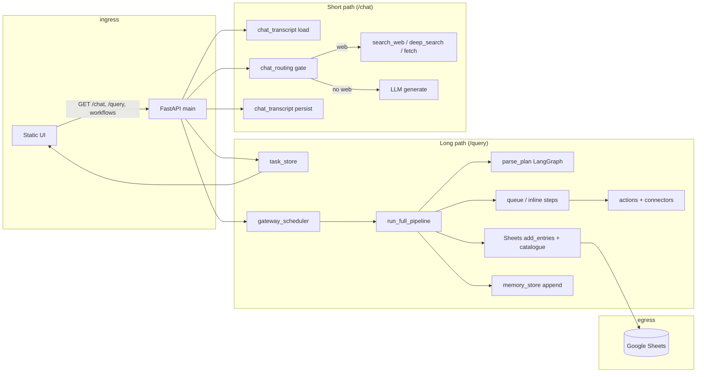

# Phase 0 — Deep Reconnaissance (`all-doing-bot`)

**Date:** 2026-03-29  
**Tests:** `python -m pytest tests -q` → **71 passed** (baseline healthy).

---

## 1. File tree map (purpose in one line)

### Root / meta
| Path | Purpose |
|------|---------|
| `AGENTS.md` | Agent/workflow rules for Cursor and coding agents |
| `README.md` | User-facing quick start, deploy, MCP, architecture sketch |
| `LICENSE` | License text |

### `apps/backend/` — FastAPI application
| Path | Purpose |
|------|---------|
| `__init__.py` | Package marker |
| `main.py` | **God module:** FastAPI app, lifespan, `/chat`, `/query`, `/health`, cohort APIs, chat formatting helpers, admin clear |
| `config.py` | Pydantic `Settings` from env (Sheets, LLM, Redis, policies, chat flags) |
| `chat_routing.py` | Structured LLM gate for `/chat` (`ChatWebRoute`) |
| `deep_search.py` | Multi-step search/fetch/rank loop for chat deep mode |
| `agents/parse_plan.py` | LangGraph parse→plan nodes + fallback sequential |
| `actions/*` | Action implementations (web_search, web_fetch, transform, browser, api_call, …) + `registry`, `contracts`, `policy` |
| `connectors/*` | Provider routing for search/fetch (MCP, SearXNG, Cloudflare, extractor bridge) |
| `mcp/*` | MCP search helper wiring |
| `db/*` | Persistence: fake/real Sheets, catalogue, memory, Google client, **chat transcript**, retry helper |
| `extractor/*` | URL → markdown pipeline + site adapters |
| `llm/*` | Multi-provider engine, prompts, JSON parse helpers |
| `models/schemas.py` | **Shared** Pydantic models (pipeline, API, memory, workflows, chat route) |
| `orchestration/*` | Queue abstraction, Redis/in-memory, run state, gateway session lanes, events |
| `pipeline/*` | Task store, enqueue router, executor (parse/plan/execute/store), stages |
| `telemetry/*` | Run context + structured logging helpers |
| `workers/run_worker.py` | Redis consumer loop for step jobs |
| `workflows/handlers.py` | Tasks/notes/chat cohort naming + append/list |
| `deploy/*` | EC2/setup scripts, IAM helpers (ops, not runtime) |

### `apps/frontend/` — static SPA
| Path | Purpose |
|------|---------|
| `index.html` | Shell: login, main layout, overlays, inline `BACKEND_URL` / client id |
| `css/style.css` | **Single large stylesheet** (hacker terminal design system inline) |
| `js/config.js` | Optional URL override |
| `js/api.js` | Fetch client, timeouts, workflow fallbacks |
| `js/auth.js` | Google Identity + dev bypass, `session_key` |
| `js/app.js` | UI logic: routing, polling, cohorts, intel drawer, chat feed |

### `tests/`
| File | Focus |
|------|--------|
| `conftest.py` | Forces MCP env for Settings validation |
| `test_*` | Pipeline, executor, actions, extractor, LLM parse, Google mocks, chat gating, fetcher, workflows, chat transcript |

### `docs/`
| Area | Purpose |
|------|---------|
| `implementation-plan.md` | Phased product spec (authoritative intent) |
| `architecture/*.md` | Overview, action contracts, durable checkpoints |
| `instructions/*` | Backend/frontend/testing workflows |
| `deployment/*` | EC2, AWS, OAuth, runbooks |
| `PRODUCT.md` | Product narrative |

---

## 2. Core data flow (ingress → transform → egress)

**Sheets** is the durable sink for cohort rows, workflow tasks/notes, and chat transcripts (`wf_*` tabs). **Redis** is optional for step distribution; without it, queue is in-process.

---

## 3. Abstraction layers — do they earn their keep?

| Layer | Verdict | Notes |
|-------|---------|-------|
| `QueueBackend` + Redis/in-memory | **Yes** | Clean test vs prod split; worker boundary explicit |
| `SheetsBackend` fake vs Google | **Yes** | Tests and no-creds dev |
| `ActionContract` + policy | **Yes** | Central place for retry/deny semantics |
| `connector_router` | **Mostly** | Some indirection duplicated with `registry` |
| LangGraph for parse+plan | **Debatable** | Graph is linear (parse→plan→END); value is dependency consistency, not topology |
| `main.py` as API + chat + formatters | **No** | Too many concerns; hurts testability and locality |
| Single `schemas.py` bucket | **Mixed** | Convenient import graph; poor boundary between API DTOs and domain |

---

## 4. Dependencies (load-bearing vs convenience)

**Load-bearing:** `fastapi`, `pydantic`, `httpx`, `gspread`+`google-auth`, `langgraph`+`langchain-core`, `mcp`, `redis` (optional), `psutil`, `readability-lxml` / `markdownify` / `bs4` / `lxml`, `respx` (tests).

**Convenience / justified:** `uvicorn`, `pytest`, `llama-cpp-python` (optional local LLM).

**Risk:** Tight coupling to **MCP as default search** — correct for product, but raises onboarding friction (documented in README).

---

## 5. Intent vs reality (docs vs code)

| Documented | Reality gap |
|------------|-------------|
| “Parse → Plan → Execute → Store” only | `/chat` bypasses full pipeline; dual mental model |
| Single-user simplicity | Session lanes + multiple stores (memory, sheets, task_store) — powerful but cognitively dense |
| “Structured pipeline only” (AGENTS.md) | Chat path has ad-hoc helpers living in `main.py` |

---

## 6. Pain points (severity-ranked)

1. **`main.py` god object** — HTTP surface, business logic, and presentation strings intertwined; hard to test `/chat` in isolation without TestClient.
2. **Dual execution paths** — Queue-first + legacy fallback + inline Redis-less behavior; correct but easy to misconfigure.
3. **Config surface explosion** — Many env flags; few validated combinations beyond MCP provider check.
4. **Frontend monolith CSS/JS** — One huge `style.css` and `app.js`; no component boundaries or build step (fine for static hosting, poor for scaling UI).
5. **Naming drift** — “Cohort” vs “collection” vs “archive” in UI; “workflow” means three different things (mode chip vs `/workflows/*` vs pipeline).
6. **Hardcoded production hints in repo** — `index.html` embeds real URLs/client ids (deployment convenience, security/process smell).
7. **Python 3.10+ stated** — Local run used 3.14 in agent environment; CI/docs should pin tested minor versions.

---

## 7. Lies (names that mislead)

| Name | Lie |
|------|-----|
| `terminal-root` | Not a TTY; it’s a web shell metaphor |
| `metrics-card` “Model” | Static label, not live model resolution from backend |
| `catalogue` | Sounds tiny; it is the master index of all cohorts |
| `memory_store` | In-process only; “memory” collides with chat “transcript memory” in Sheets |

---

## 8. Proposed target architecture (preview)

See **`ARCHITECTURE.md`**: routers per boundary (`api/chat`, `api/pipeline`, `api/workflows`), services for orchestration, `main.py` as thin composition root; frontend tokens extracted to a small design file and documented in **`DESIGN_SYSTEM.md`**.

---

## 9. Phase 0 exit criteria

- [x] Full tree mapped (excluding `.git` objects).
- [x] Data flow diagram produced.
- [x] Pain points and naming debt catalogued.
- [x] Tests run successfully on current tree.

**Human review:** Approve `ARCHITECTURE.md` before large-scale moves (Phase 3).
